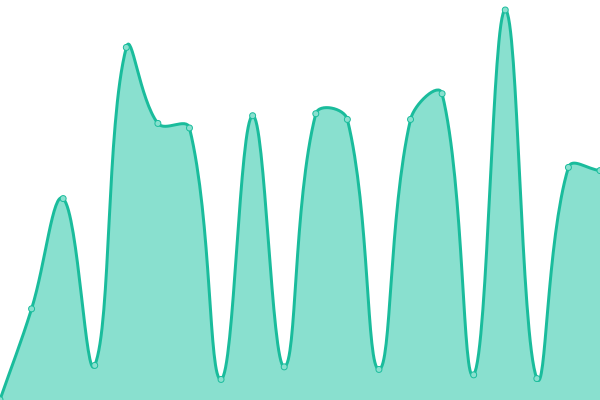
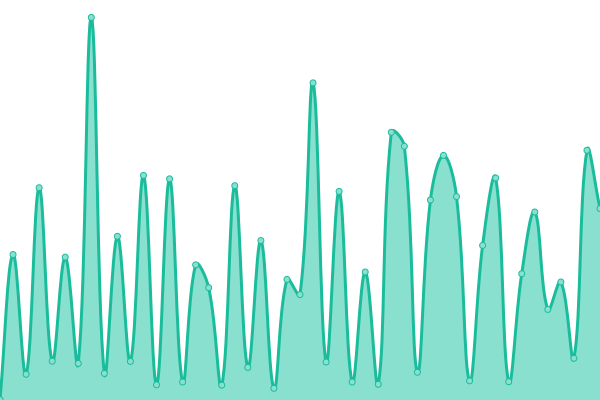
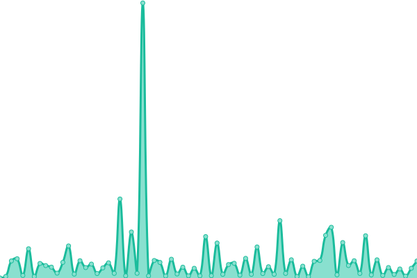
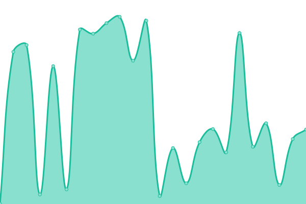

# [📈 Live Status](https://status.mkacg.com): <!--live status--> **🟧 Partial outage**

This repository contains the open-source uptime monitor and status page for [爱折腾的小竹同学](https://blog.justforlxz.com), powered by [Upptime](https://github.com/upptime/upptime).

With [Upptime](https://upptime.js.org), you can get your own unlimited and free uptime monitor and status page, powered entirely by a GitHub repository. We use [Issues](https://github.com/justforlxz/status.mkacg.com/issues) as incident reports, [Actions](https://github.com/justforlxz/status.mkacg.com/actions) as uptime monitors, and [Pages](https://status.mkacg.com) for the status page.

<!--start: status pages-->
<!-- This summary is generated by Upptime (https://github.com/upptime/upptime) -->
<!-- Do not edit this manually, your changes will be overwritten -->
<!-- prettier-ignore -->
| URL | Status | History | Response Time | Uptime |
| --- | ------ | ------- | ------------- | ------ |
|  [Misskey](https://mkacg.social) | 🟥 Down | [misskey.yml](https://github.com/justforlxz/status.mkacg.com/commits/HEAD/history/misskey.yml) | 

 911ms
     
 | 

<a href="https://status.mkacg.com/history/misskey">82.51%</a>
    

|  [Matrix](https://matrix.mkacg.chat) | 🟥 Down | [matrix.yml](https://github.com/justforlxz/status.mkacg.com/commits/HEAD/history/matrix.yml) | 

 0ms
     
 | 

<a href="https://status.mkacg.com/history/matrix">0.00%</a>
    

|  [NextCloud](https://pan.mkacg.com) | 🟥 Down | [next-cloud.yml](https://github.com/justforlxz/status.mkacg.com/commits/HEAD/history/next-cloud.yml) | 

 0ms
     
 | 

<a href="https://status.mkacg.com/history/next-cloud">0.00%</a>
    

|  [S3](https://s3.mkacg.social) | 🟥 Down | [s3.yml](https://github.com/justforlxz/status.mkacg.com/commits/HEAD/history/s3.yml) | 

 165ms
     
 | 

<a href="https://status.mkacg.com/history/s3">0.00%</a>
    

|  [Docs](https://docs.mkacg.social) | 🟩 Up | [docs.yml](https://github.com/justforlxz/status.mkacg.com/commits/HEAD/history/docs.yml) | 

 283ms
     
 | 

<a href="https://status.mkacg.com/history/docs">100.00%</a>
    

|  [Bitwarden](https://bitwarden.mkacg.com) | 🟩 Up | [bitwarden.yml](https://github.com/justforlxz/status.mkacg.com/commits/HEAD/history/bitwarden.yml) | 

 695ms
     
 | 

<a href="https://status.mkacg.com/history/bitwarden">83.97%</a>
    

|  [Jellyfin](https://video.mkacg.com) | 🟩 Up | [jellyfin.yml](https://github.com/justforlxz/status.mkacg.com/commits/HEAD/history/jellyfin.yml) | 

 624ms
     
 | 

<a href="https://status.mkacg.com/history/jellyfin">82.16%</a>
    

|  [qBittorrent](https://bt.justforlxz.com) | 🟩 Up | [q-bittorrent.yml](https://github.com/justforlxz/status.mkacg.com/commits/HEAD/history/q-bittorrent.yml) | 

 425ms
     
 | 

<a href="https://status.mkacg.com/history/q-bittorrent">82.52%</a>
    

|  [AutoBangumi](https://autobangumi.mkacg.com) | 🟥 Down | [auto-bangumi.yml](https://github.com/justforlxz/status.mkacg.com/commits/HEAD/history/auto-bangumi.yml) | 

 343ms
     
 | 

<a href="https://status.mkacg.com/history/auto-bangumi">36.48%</a>
    

<!--end: status pages-->

[**Visit our status website →**](https://status.mkacg.com)

## 📄 License

- Powered by: [Upptime](https://github.com/upptime/upptime)
- Code: [MIT](./LICENSE) © [爱折腾的小竹同学](https://blog.justforlxz.com)
- Data in the `./history` directory: [Open Database License](https://opendatacommons.org/licenses/odbl/1-0/)
